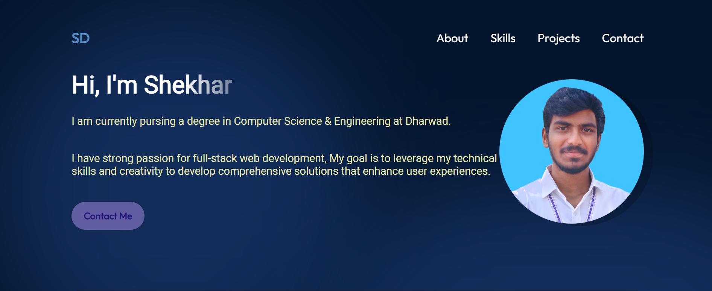

# 🚀 Portfolio Website

Welcome to my **Portfolio Website**! This website serves as my online resume, showcasing my skills, projects, and ways to get in touch.

## 🌟 Features

- **About Section** - A brief introduction about me.
- **Skills** - Highlights my technical and non-technical skills.
- **Projects** - Displays my top projects with descriptions and links.
- **Contact Form** - Allows visitors to reach out to me easily.
- **Responsive Design** - Works seamlessly across different devices.

## 🖼️ Screenshot



## 🛠️ Tech Stack

This project is built using:
- **HTML5, CSS3, JavaScript** for front-end development.
- (Add other technologies if used, e.g., React, Bootstrap, etc.)

## 🚀 Live Demo

You can check out the live version of my portfolio here:  
👉 [Live Demo](https://your-live-portfolio-link.com) *(Replace with your actual link if available)*

## 🔧 Installation & Setup

To run this project locally, follow these steps:

1. **Clone the repository**  
   ```bash
   git clone https://github.com/Shekhar7373/Portfolio-Website.git
